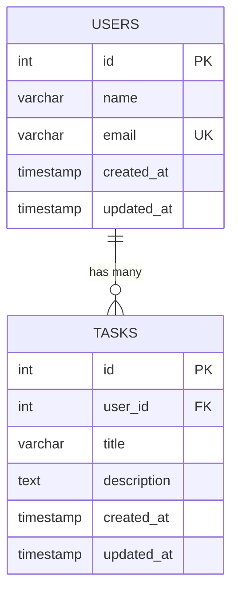

# Database Schema Mermaid Generator

This feature automatically generates Mermaid ER diagrams from your Laravel database schema.

## Usage

### Web Interface

Visit `/dev/schema-mermaid` in your browser to view the interactive database schema diagram.

The page provides:
- Visual display of the Mermaid diagram (when CDN is accessible)
- Copy to clipboard functionality
- Toggle to view/hide the raw Mermaid code
- Information about the diagram structure

### Programmatic Usage

```php
use App\Services\SchemaMermaidGenerator;

$generator = new SchemaMermaidGenerator();
$mermaidCode = $generator->generate();

echo $mermaidCode;
```

### Custom Ignored Tables

You can customize which tables to ignore:

```php
use App\Services\SchemaMermaidGenerator;

$ignoredTables = ['migrations', 'my_custom_table'];
$generator = new SchemaMermaidGenerator($ignoredTables);
$mermaidCode = $generator->generate();
```

## Features

- ✅ Supports MySQL, PostgreSQL, and SQLite
- ✅ Automatically detects tables and columns
- ✅ Marks primary keys (PK), foreign keys (FK), and unique keys (UK)
- ✅ Shows relationships between tables
- ✅ Excludes system tables by default
- ✅ Generates valid Mermaid syntax

## Default Ignored Tables

The generator ignores these tables by default:
- migrations
- failed_jobs
- password_reset_tokens
- personal_access_tokens
- cache
- cache_locks
- sessions
- job_batches
- jobs

## Output Format

The generator produces Mermaid ER diagram syntax:



## Viewing the Diagram

You can view the generated Mermaid code in several ways:

1. **In the Laravel app** - Visit `/dev/schema-mermaid`
2. **Mermaid Live Editor** - Copy the code and paste it at https://mermaid.live/
3. **GitHub/GitLab** - Use in Markdown files with mermaid code blocks
4. **Documentation** - Embed in your project documentation

## Testing

The feature includes comprehensive tests:

- **Unit Tests** (`tests/Unit/SchemaMermaidGeneratorTest.php`) - 12 tests
- **Feature Tests** (`tests/Feature/SchemaMermaidControllerTest.php`) - 5 tests

Run tests with:

```bash
php artisan test --filter=SchemaMermaid
```

## Database Support

The generator supports the following database systems:

- **MySQL/MariaDB** - Full support
- **PostgreSQL** - Full support
- **SQLite** - Full support

Each database driver uses the appropriate system tables or commands:
- MySQL: INFORMATION_SCHEMA
- PostgreSQL: information_schema and pg_catalog
- SQLite: PRAGMA commands
